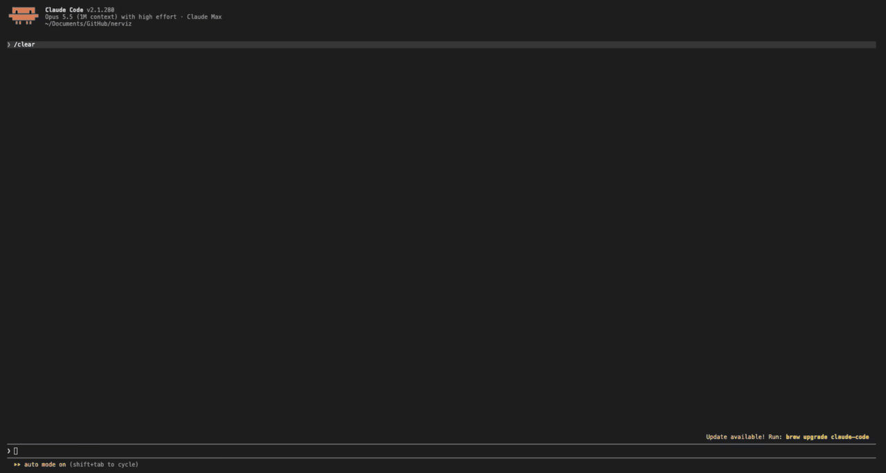
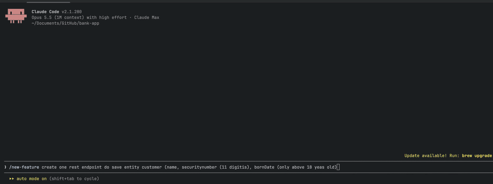

# bank-app

[](https://github.com/nerviz-ai/bank-app/actions/workflows/build.yml)
[](https://sonarcloud.io/summary/new_code?id=nerviz-ai_bank-app)
[](https://sonarcloud.io/component_measures?id=nerviz-ai_bank-app&metric=coverage)
[](https://sonarcloud.io/project/issues?id=nerviz-ai_bank-app&types=BUG)
[](https://sonarcloud.io/project/issues?id=nerviz-ai_bank-app&types=VULNERABILITY)
[](https://sonarcloud.io/project/issues?id=nerviz-ai_bank-app&types=CODE_SMELL)

Spring Boot project generated by [Nerviz](https://github.com/nerviz-ai/nerviz),
already prepared for AI-assisted development with Claude Code.

*[Versão em português](README.pt-br.md)*

## Code quality

Full report on SonarQube Cloud: **<https://sonarcloud.io/project/overview?id=nerviz-ai_bank-app>**

[](https://sonarcloud.io/summary/new_code?id=nerviz-ai_bank-app)

| Reliability | Security | Maintainability | Coverage | Duplication | Technical debt | Lines of code |
|:---:|:---:|:---:|:---:|:---:|:---:|:---:|
| [](https://sonarcloud.io/project/issues?id=nerviz-ai_bank-app&impactSoftwareQualities=RELIABILITY) | [](https://sonarcloud.io/project/issues?id=nerviz-ai_bank-app&impactSoftwareQualities=SECURITY) | [](https://sonarcloud.io/project/issues?id=nerviz-ai_bank-app&impactSoftwareQualities=MAINTAINABILITY) | [](https://sonarcloud.io/component_measures?id=nerviz-ai_bank-app&metric=coverage) | [](https://sonarcloud.io/component_measures?id=nerviz-ai_bank-app&metric=duplicated_lines_density) | [](https://sonarcloud.io/component_measures?id=nerviz-ai_bank-app&metric=sqale_index) | [](https://sonarcloud.io/component_measures?id=nerviz-ai_bank-app&metric=ncloc) |

The card and the metrics above are rendered live by SonarQube Cloud and change after every
analysis of `main`. GitHub strips `<iframe>` from a README, so the dashboard itself cannot be
embedded: click any image to open the matching page of the report.

## CI pipeline

[`.github/workflows/build.yml`](.github/workflows/build.yml) runs on every push to `main`,
on every pull request, and on demand. It has two jobs.

**`build and tests`** sets up JDK 21 (Temurin) with the Maven cache, then runs
`./mvnw -B clean verify`. That one command covers:

| Phase | Check | Fails the build when |
|---|---|---|
| `validate` | Checkstyle on `src/main` (`config/checkstyle/checkstyle.xml`) | any violation |
| `test` | Unit tests (Surefire) | a test fails |
| `integration-test` | Integration tests (Failsafe) with Testcontainers. The runner has Docker, so Postgres really starts | an integration test fails |
| `verify` | Spotless: Palantir Java Format and unused imports | a file is not formatted |
| `verify` | Checkstyle on `src/test` (`config/checkstyle/checkstyle-test.xml`) | any violation |
| `verify` | JaCoCo coverage report | never: report only, no gate yet |

A last step, `integration tests actually ran`, reads `failsafe-summary.xml` when any
`*IT.java` exists. It fails when an integration test was skipped or none ran. Without it,
a Docker guard or `@Disabled` could turn the tests off and `verify` would still be green.

The job ends with `sonar analysis`: `./mvnw -B sonar:sonar` sends the classes and the JaCoCo
report to SonarQube Cloud, organization `nerviz-ai`. The step reads the `SONAR_TOKEN`
repository secret and is skipped when it is absent, as on a pull request from a fork. The
checkout uses `fetch-depth: 0` so the analysis can tell new code from old. Automatic Analysis
is off on SonarQube Cloud: this step is the only analysis.

**Public report:** <https://sonarcloud.io/project/overview?id=nerviz-ai_bank-app> — quality gate, coverage, issues and duplication, updated on every
push to `main`.

**`architectural boundaries`** runs `java .claude/hooks/ArchHook.java doctor`. It prints the
boundary rules, the extension schema, the hook jar, the hook registrations and the compose
checks. It reports only: `doctor` exits 0 even when a line is marked ❌.

Not in CI yet: ArchUnit and the 80%/70% coverage gate, which `test-architect` installs.

## Origin

Generated from the Nerviz meta-repo, with:

```
/init-project
```

The run that generated it, sped up about 5×: the interview, the background agent, the final
report and the push to GitHub.

<p align="center">
  
</p>

| Parameter | Value |
|---|---|
| groupId | `dev.nerviz` |
| artifactId | `bank-app` |
| Project name | `bank-app` |
| Target directory | `/Users/U131923/Documents/GitHub/bank-app` |

The command ran from the Nerviz repository, but this project is
self-contained — nothing here depends on the meta-repo existing on whoever clones it.
See `CLAUDE.md` for the full architecture; this file only orients a first-time reader.

## First use case

[`UC-001-spec.md`](docs/use-cases/UC-001-create-customer/UC-001-spec.md) was designed with:

```
/new-feature create one rest endpoint do save entity customer (name, securitynumber (11 digitis), bornDate (only above 18 yeas old)
```

The run that created it: the interview, then `use-case-design`, `domain-modeling`,
`rest-api-architect`, `persistence-architect` and `test-architect` writing their partials,
the consolidated spec approved and pushed.

<p align="center">
  
</p>

## Blueprint

`clean-architecture-single-module` — Same domain/application/infrastructure separation as
`clean-architecture-multi-module`, but in a single Maven module: the modules become
packages, and the boundary is enforced only by ArchUnit, not the compiler.

## Stack and versions

Resolved live by the Spring Initializr at generation time — never pinned from memory:

- Java 21
- Spring Boot 4.1.1
- Build: maven

## Active features

- `rest` — Spring MVC inbound adapter
- `validation` — Bean Validation on DTOs, mandatory alongside `rest`
- `persistence-jpa` — Spring Data JPA + PostgreSQL driver
- `uuid-v7` — sortable UUIDs for primary keys (`java-uuid-generator`)
- `flyway` — versioned schema migrations
- `openapi` — springdoc OpenAPI + Swagger UI
- `testcontainers` — PostgreSQL container for integration tests
- `actuator` — health, info and metrics endpoints
- `observability` — OpenTelemetry tracing bridge + OTLP exporter
- `archunit` — recorded for `test-architect`, not yet installed (see Next steps)

Not active: `messaging-kafka`, `messaging-sqs`.

## Architecture of `.claude/`

This project carries its own `.claude/`, laid out the same way as the meta-repo that
generated it:

- **Hooks** (`.claude/hooks/ArchHook.java`) enforce deterministically — layer boundaries
  (`.claude/forbidden-imports.txt`), frontmatter, Lombok config. What they check,
  nothing bypasses without editing the hook.
- **Skills** (`.claude/skills/`) hold procedure. Invoke one directly as `/<skill-name>`,
  or describe the task and Claude routes to it.
- **Agents** (`.claude/agents/`) run an isolated step a skill delegates to — for
  context, restricted tools, or a different model.
- **Rules** (`.claude/rules/`) are the leaf: norms cited by skills and agents, never
  invoking anything themselves. Index at `.claude/rules/00-index.md`.

### Skills available

- `arch-adopt` — installs or updates this `.claude/` inside a Java project from a newer Nerviz blueprint
- `arch-doctor` — diagnoses the AI setup and architecture enforcement on this machine
- `audit-usage` — reads the `.claude/audit-usage/` trail and reports spend, duration and failures per skill/agent run
- `docker-architect` — single owner of every `docker-compose.yml`/`Dockerfile` service block added after generation
- `domain-modeling` — details a use case's domain and application layer (aggregate, ports, events) into `10-dominio.md`
- `git-publish` — offers to git init/commit and create+push a GitHub repo, behind two confirmations
- `gof-design-patterns` — chooses and implements a design pattern from the symptom that justifies it
- `http-client-architect` — designs the outbound HTTP adapter of an already-modeled use case
- `jobs-architect` — designs scheduled/background jobs for an already-scoped use case
- `messaging-architect` — designs the Kafka producer/consumer adapter for a domain event
- `new-feature` — orchestrates the full feature pipeline, one use case per run
- `persistence-architect` — designs tables, JPA mapping, migrations and datasource config
- `report-issue` — files an issue on the Nerviz repository from this project
- `rest-api-architect` — designs the inbound REST adapter (endpoints, DTOs, OpenAPI)
- `security-architect` — designs who may call each endpoint with Spring Security
- `sonar-lessons` — turns a SonarQube analysis into a lessons-learned filed upstream
- `sonarqube-setup` — configures SonarQube analysis (already run for this project)
- `test-architect` — designs tests and installs ArchUnit + the coverage gate
- `transport-security-setup` — decides where TLS terminates (already run for this project)
- `use-case-design` — delimits a use case's boundary and emits the parent spec

### Agents available

- `archunit-installer` — installs ArchUnit and the JaCoCo coverage gate, invoked by `test-architect`'s setup mode
- `commons-logging-installer` — installs the logging/masking annotations and AOP aspects into `commons`, invoked by `/new-feature`
- `java-spring-boot-developer` — implements Java code from an approved `spec.md`

## Generation report

Captured here in the meta-repo, at the end of the run that created this project — not
reconstructed afterward:

```
✅ Project bank-app created — blueprint clean-architecture-single-module

Modules:
  . → depends on nothing

Versions (resolved by the Initializr): Java 21 · Spring Boot 4.1.1 · maven
Active features: rest, validation, persistence-jpa, uuid-v7, flyway, openapi, testcontainers, actuator, observability, archunit
Business code: none — by design. 13 package-info.java written
Boundaries: 15 rules in .claude/forbidden-imports.txt — blocking verified ✓
Checkstyle: config/checkstyle/checkstyle.xml — plugin 3.6.0 · tool 14.3.0, validate phase · checkstyle-test.xml over src/test
Spotless: check bound to the build (verify) — formatting and unused imports, main and test
Lombok: lombok.config at the root — @Data and @Setter stop compilation
ArchUnit: to be installed — `test-architect` skill (see Next steps)
Coverage: JaCoCo generates a report; the 80%/70% gate comes in with `test-architect`
Self-contained: 19 rules + 20 skills + 3 agents + ArchHook.java + extensions.json written by `ArchHook.java export` — no dead paths ✓
Provenance: .claude/.arch-provenance.json — blueprint clean-architecture-single-module, ref working-tree, commit c95951f. `/arch-doctor` reports anything edited since
Audit trail: .claude/audit-usage/ active — one report per skill or agent invocation from now on, by `/command` or by the model. GENESIS.md records this run itself. Fill pricing.json to see cost
Docker: Dockerfile + docker-compose.yml — app, postgres (persistence-jpa), otel-collector (observability), sonarqube (local SonarQube, sonarqube-setup) — extend with `docker-architect` for anything a future use case adds
Local secrets: .env (untracked) holds DB_PASSWORD, read by docker compose and imported by application.yml for the host run; a fresh clone copies .env.example
Observability UI: none — the collector exports to `debug`, which writes spans and metrics to its own stdout and is not a dashboard. Run `/docker-architect` to add one: Jaeger (traces, one container) or Grafana + Tempo + Prometheus (traces and metrics, three)
Transport: topology A edge — HTTP/2 on, HSTS by HstsHeaderFilter, ForwardedHeadersIT
SonarQube: local container on http://localhost:9000 — scanner 5.8.0.7211, CI step none
MCP: none — no server designed for this project yet
Build: PASSED
Docs: README.md (English, default) + README.pt-br.md — origin, blueprint, stack, skills/agents, this report

Next steps:
  1. /use-case-design <first-use-case-name>
  2. Install the architecture tests (ArchUnit) and wire up the coverage gate with the
     `test-architect` skill as soon as business classes exist. Until then boundaries
     are guaranteed only by the hook (inside Claude Code). This blueprint is
     `layout: single-module`: there is no per-layer POM, so outside Claude Code (a plain
     `mvn verify`, or any edit made without it) the project has no enforcement at all.
  3. SonarQube — local: `docker compose up -d sonarqube`, log in at http://localhost:9000
     as admin/admin (a password change is forced), create a token under My Account →
     Security, `export SONAR_TOKEN=…`, then `./mvnw -B verify sonar:sonar`
```

## Next steps

1. `/use-case-design <first-use-case-name>`
2. Install the architecture tests (ArchUnit) and wire up the coverage gate with the
   `test-architect` skill as soon as business classes exist. Until then boundaries
   are guaranteed only by the hook (inside Claude Code). This blueprint is
   `layout: single-module`: there is no per-layer POM, so outside Claude Code (a plain
   `mvn verify`, or any edit made without it) the project has no enforcement at all.
3. SonarQube — runs in CI against SonarQube Cloud, report at <https://sonarcloud.io/project/overview?id=nerviz-ai_bank-app>. To analyze
   against a local server instead: `docker compose up -d sonarqube`, log in at
   http://localhost:9000 as admin/admin (a password change is forced), create a token under
   My Account → Security, `export SONAR_TOKEN=…`, then
   `./mvnw -B verify sonar:sonar -Dsonar.host.url=http://localhost:9000`
