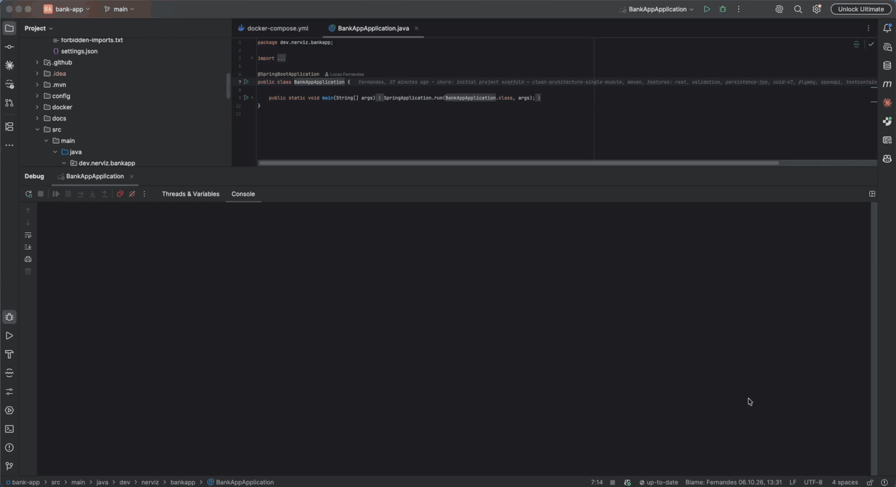
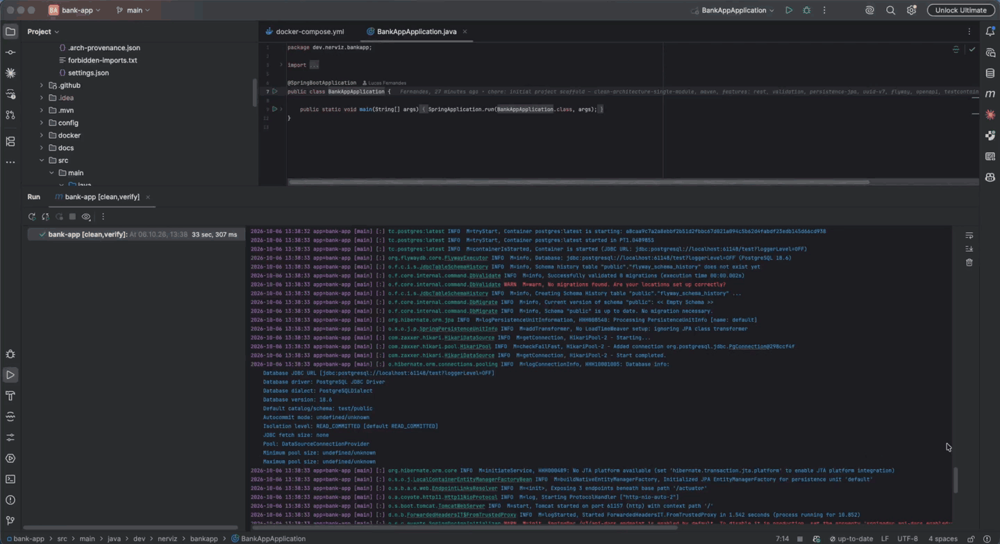

# bank-app

Projeto Spring Boot gerado por [Nerviz](https://github.com/nerviz-ai/nerviz),
já preparado para desenvolvimento assistido por IA com Claude Code.

*[English version](README.md)*

## Rodando

Iniciado pela IDE contra o Postgres do compose: o Flyway valida o schema e o Tomcat sobe na
porta 8080.

<p align="center">
  
</p>

O `./mvnw clean verify` passa com testes, Spotless, Checkstyle e JaCoCo.

<p align="center">
  
</p>

## Origem

Gerado a partir do meta-repo Nerviz, com:

```
/init-project
```

| Parâmetro | Valor |
|---|---|
| groupId | `dev.nerviz` |
| artifactId | `bank-app` |
| Nome do projeto | `bank-app` |
| Diretório de destino | `/Users/U131923/Documents/GitHub/bank-app` |

O comando foi executado a partir do repositório Nerviz, mas este
projeto é autocontido — nada aqui depende do meta-repo existir na máquina de quem clona.
Veja `CLAUDE.md` para a arquitetura completa; este arquivo só orienta uma primeira
leitura.

## Blueprint

`clean-architecture-single-module` — Mesma separação domain/application/infrastructure
do `clean-architecture-multi-module`, mas em um único módulo Maven: os módulos viram
pacotes, e o limite é verificado apenas pelo ArchUnit, não pelo compilador.

## Stack e versões

Resolvidas em tempo real pelo Spring Initializr no momento da geração — nunca fixadas de
memória:

- Java 21
- Spring Boot 4.1.1
- Build: maven

## Features ativas

- `rest` — adaptador de entrada Spring MVC
- `validation` — Bean Validation nos DTOs, obrigatória junto com `rest`
- `persistence-jpa` — Spring Data JPA + driver PostgreSQL
- `uuid-v7` — UUIDs ordenáveis para chaves primárias (`java-uuid-generator`)
- `flyway` — migrações de schema versionadas
- `openapi` — springdoc OpenAPI + Swagger UI
- `testcontainers` — container PostgreSQL para testes de integração
- `actuator` — endpoints de health, info e metrics
- `observability` — ponte de tracing OpenTelemetry + exportador OTLP
- `archunit` — registrado para o `test-architect`, ainda não instalado (ver Próximos passos)

Não ativas: `messaging-kafka`, `messaging-sqs`.

## Arquitetura do `.claude/`

Este projeto carrega seu próprio `.claude/`, organizado da mesma forma que o meta-repo
que o gerou:

- **Hooks** (`.claude/hooks/ArchHook.java`) fazem a aplicação determinística — limites
  entre camadas (`.claude/forbidden-imports.txt`), frontmatter, configuração do Lombok.
  O que eles checam, nada contorna sem editar o hook.
- **Skills** (`.claude/skills/`) carregam o procedimento. Invoque uma diretamente como
  `/<nome-da-skill>`, ou descreva a tarefa e o Claude roteia até ela.
- **Agents** (`.claude/agents/`) rodam um passo isolado que uma skill delega — por
  contexto, tools restritas, ou modelo diferente.
- **Rules** (`.claude/rules/`) são a folha: normas citadas por skills e agents, nunca
  invocam nada. Índice em `.claude/rules/00-index.md`.

### Skills disponíveis

- `arch-adopt` — instala ou atualiza este `.claude/` dentro de um projeto Java a partir de um blueprint Nerviz mais novo
- `arch-doctor` — diagnostica a configuração de IA e a aplicação da arquitetura nesta máquina
- `audit-usage` — lê o rastro de `.claude/audit-usage/` e reporta gasto, duração e falhas por execução
- `docker-architect` — dono único de todo bloco de serviço em `docker-compose.yml`/`Dockerfile` adicionado depois da geração
- `domain-modeling` — detalha domínio e aplicação de um caso de uso já desenhado em `10-dominio.md`
- `git-publish` — oferece git init/commit e criar+push um repositório GitHub, atrás de duas confirmações
- `gof-design-patterns` — escolhe e implementa um padrão de projeto a partir do sintoma que o justifica
- `http-client-architect` — desenha o adaptador HTTP de saída de um caso de uso já modelado
- `jobs-architect` — desenha jobs agendados/em background para um caso de uso já delimitado
- `messaging-architect` — desenha o adaptador produtor/consumidor Kafka para um evento de domínio
- `new-feature` — orquestra o pipeline completo de feature, um caso de uso por execução
- `persistence-architect` — desenha tabelas, mapeamento JPA, migrações e configuração do datasource
- `report-issue` — registra uma issue no repositório Nerviz a partir deste projeto
- `rest-api-architect` — desenha o adaptador REST de entrada (endpoints, DTOs, OpenAPI)
- `security-architect` — desenha quem pode chamar cada endpoint com Spring Security
- `sonar-lessons` — transforma uma análise SonarQube em uma lição aprendida registrada no repositório de origem
- `sonarqube-setup` — configura a análise SonarQube (já executada para este projeto)
- `test-architect` — desenha testes e instala o ArchUnit + o gate de cobertura
- `transport-security-setup` — decide onde o TLS termina (já executado para este projeto)
- `use-case-design` — delimita a fronteira de um caso de uso e emite a spec pai

### Agents disponíveis

- `archunit-installer` — instala o ArchUnit e o gate de cobertura JaCoCo, invocado pelo modo setup do `test-architect`
- `commons-logging-installer` — instala as anotações de logging/masking e os aspectos AOP em `commons`, invocado pelo `/new-feature`
- `java-spring-boot-developer` — implementa código Java a partir de um `spec.md` aprovado

## Relatório da geração

Capturado aqui no meta-repo, ao final da execução que criou este projeto — não
reconstruído depois:

```
✅ Project bank-app created — blueprint clean-architecture-single-module

Modules:
  . → depends on nothing

Versions (resolved by the Initializr): Java 21 · Spring Boot 4.1.1 · maven
Active features: rest, validation, persistence-jpa, uuid-v7, flyway, openapi, testcontainers, actuator, observability, archunit
Business code: none — by design. 13 package-info.java written
Boundaries: 15 rules in .claude/forbidden-imports.txt — blocking verified ✓
Checkstyle: config/checkstyle/checkstyle.xml — plugin 3.6.0 · tool 14.3.0, validate phase · checkstyle-test.xml over src/test
Spotless: check bound to the build (verify) — formatting and unused imports, main and test
Lombok: lombok.config at the root — @Data and @Setter stop compilation
ArchUnit: to be installed — `test-architect` skill (see Next steps)
Coverage: JaCoCo generates a report; the 80%/70% gate comes in with `test-architect`
Self-contained: 19 rules + 20 skills + 3 agents + ArchHook.java + extensions.json written by `ArchHook.java export` — no dead paths ✓
Provenance: .claude/.arch-provenance.json — blueprint clean-architecture-single-module, ref working-tree, commit c95951f. `/arch-doctor` reports anything edited since
Audit trail: .claude/audit-usage/ active — one report per skill or agent invocation from now on, by `/command` or by the model. GENESIS.md records this run itself. Fill pricing.json to see cost
Docker: Dockerfile + docker-compose.yml — app, postgres (persistence-jpa), otel-collector (observability), sonarqube (local SonarQube, sonarqube-setup) — extend with `docker-architect` for anything a future use case adds
Local secrets: .env (untracked) holds DB_PASSWORD, read by docker compose and imported by application.yml for the host run; a fresh clone copies .env.example
Observability UI: none — the collector exports to `debug`, which writes spans and metrics to its own stdout and is not a dashboard. Run `/docker-architect` to add one: Jaeger (traces, one container) or Grafana + Tempo + Prometheus (traces and metrics, three)
Transport: topology A edge — HTTP/2 on, HSTS by HstsHeaderFilter, ForwardedHeadersIT
SonarQube: local container on http://localhost:9000 — scanner 5.8.0.7211, CI step none
MCP: none — no server designed for this project yet
Build: PASSED
Docs: README.md (English, default) + README.pt-br.md — origin, blueprint, stack, skills/agents, this report

Next steps:
  1. /use-case-design <first-use-case-name>
  2. Install the architecture tests (ArchUnit) and wire up the coverage gate with the
     `test-architect` skill as soon as business classes exist. Until then boundaries
     are guaranteed only by the hook (inside Claude Code). This blueprint is
     `layout: single-module`: there is no per-layer POM, so outside Claude Code (a plain
     `mvn verify`, or any edit made without it) the project has no enforcement at all.
  3. SonarQube — local: `docker compose up -d sonarqube`, log in at http://localhost:9000
     as admin/admin (a password change is forced), create a token under My Account →
     Security, `export SONAR_TOKEN=…`, then `./mvnw -B verify sonar:sonar`
```

## Próximos passos

1. `/use-case-design <nome-do-primeiro-caso-de-uso>`
2. Instalar os testes de arquitetura (ArchUnit) e ligar o gate de cobertura com a skill
   `test-architect` assim que existirem classes de negócio. Até lá os limites são
   garantidos apenas pelo hook (dentro do Claude Code). Este blueprint é
   `layout: single-module`: não há POM por camada, então fora do Claude Code (um
   `mvn verify` simples, ou qualquer edição feita sem ele) o projeto não tem
   nenhuma aplicação de limite.
3. SonarQube — local: `docker compose up -d sonarqube`, faça login em
   http://localhost:9000 como admin/admin (troca de senha obrigatória), crie um token em
   My Account → Security, `export SONAR_TOKEN=…`, depois `./mvnw -B verify sonar:sonar`
